# CohortCharacteristics <a href="https://darwin-eu.github.io/CohortCharacteristics/"></a>

[](https://CRAN.R-project.org/package=CohortCharacteristics)
[](https://app.codecov.io/github/darwin-eu/CohortCharacteristics?branch=main)
[](https://github.com/darwin-eu/CohortCharacteristics/actions)
[](https://lifecycle.r-lib.org/articles/stages.html#experimental)

## Package overview

CohortCharacteristics contains functions for summarising characteristics
of cohorts of patients identified in an OMOP CDM dataset. Once a cohort
table has been created, CohortCharacteristics provides a number of
functions to help provide a summary of the characteristics of the
individuals within the cohort.

    #> To cite package 'CohortCharacteristics' in publications use:
    #> 
    #>   Catala M, Guo Y, Lopez-Guell K, Burn E, Mercade-Besora N, Alcalde M
    #>   (????). _CohortCharacteristics: Summarise and Visualise
    #>   Characteristics of Patients in the OMOP CDM_. R package version
    #>   0.4.0, <https://darwin-eu.github.io/CohortCharacteristics/>.
    #> 
    #> A BibTeX entry for LaTeX users is
    #> 
    #>   @Manual{,
    #>     title = {CohortCharacteristics: Summarise and Visualise Characteristics of Patients in the OMOP CDM},
    #>     author = {Marti Catala and Yuchen Guo and Kim Lopez-Guell and Edward Burn and Nuria Mercade-Besora and Marta Alcalde},
    #>     note = {R package version 0.4.0},
    #>     url = {https://darwin-eu.github.io/CohortCharacteristics/},
    #>   }

## Package installation

You can install the latest version of CohortCharacteristics from CRAN:

``` r
install.packages("CohortCharacteristics")
```

Or install the development version from github:

``` r
install.packages("pak")
pak::pkg_install("darwin-eu/CohortCharacteristics")
```

``` r
library(CohortCharacteristics)
```

## Content

The package contain three types of functions:

- **summarise**\* type functions. These functions produce
  <summarised_result> standard output. See
  [omopgenerics](https://darwin-eu.github.io/omopgenerics/articles/summarised_result.html)
  for more information on this standardised output format. These
  functions are the ones that do the work in terms of extracting the
  necessary data from the cdm and summarising it.
- **table**\* type functions. These functions work with the output of
  the summarise ones. They will produce a table visualisation created
  using the
  [visOmopResults](https://cran.r-project.org/package=visOmopResults)
  package.
- **plot**\* type functions. These functions work with the output of the
  summarise ones. They will produce a plot visualisation created using
  the
  [visOmopResults](https://cran.r-project.org/package=visOmopResults)
  package.

## Examples

### Mock data

Although the package provides some simple mock data for testing
(`mockCohortCharacteristics()`), for these examples we will use the
GiBleed dataset that can be downloaded using the CDMConnector package
that will give us some more real results.

``` r
library(CDMConnector)
library(duckdb)
library(dplyr, warn.conflicts = FALSE)
requireEunomia()
con <- dbConnect(duckdb(), eunomiaDir())
cdm <- cdmFromCon(con = con, cdmSchema = "main", writeSchema = "main")
```

Let’s create a simple cohort:

``` r
library(DrugUtilisation)
cdm <- generateIngredientCohortSet(cdm = cdm, name = "my_cohort", ingredient = c("warfarin", "acetaminophen"))
```

### Cohort counts

We can get counts using the function `summariseCohortCount()`:

``` r
result <- summariseCohortCount(cdm$my_cohort)
result |>
  glimpse()
#> Rows: 4
#> Columns: 13
#> $ result_id        <int> 1, 1, 1, 1
#> $ cdm_name         <chr> "Synthea synthetic health database", "Synthea synthet…
#> $ group_name       <chr> "cohort_name", "cohort_name", "cohort_name", "cohort_…
#> $ group_level      <chr> "11289_warfarin", "11289_warfarin", "161_acetaminophe…
#> $ strata_name      <chr> "overall", "overall", "overall", "overall"
#> $ strata_level     <chr> "overall", "overall", "overall", "overall"
#> $ variable_name    <chr> "Number records", "Number subjects", "Number records"…
#> $ variable_level   <chr> NA, NA, NA, NA
#> $ estimate_name    <chr> "count", "count", "count", "count"
#> $ estimate_type    <chr> "integer", "integer", "integer", "integer"
#> $ estimate_value   <chr> "137", "137", "13907", "2679"
#> $ additional_name  <chr> "overall", "overall", "overall", "overall"
#> $ additional_level <chr> "overall", "overall", "overall", "overall"
```

You can easily create a table using the associated table function,
`tableCohortCount()`:

``` r
tableCohortCount(result, type = "flextable")
```

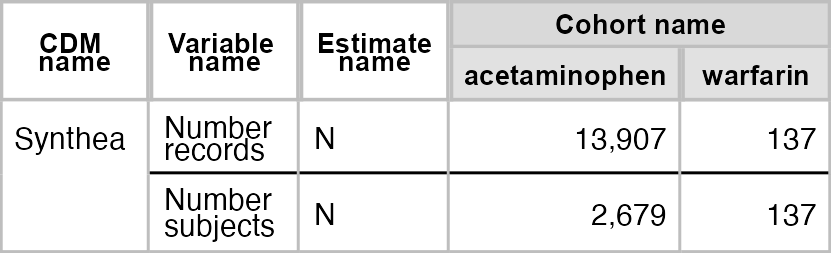

We could create a simple plot with `plotCohortCount()`:

``` r
result |>
  filter(variable_name == "Number subjects") |>
  plotCohortCount(x = "cohort_name", colour = "cohort_name")
```

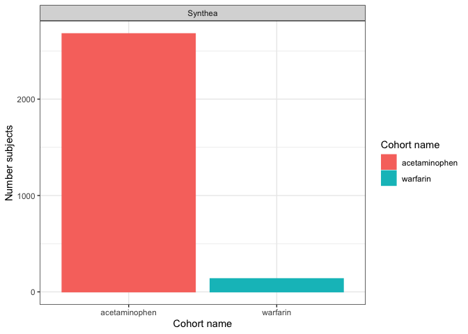

All the other function work using the same dynamic, first `summarise`,
then `plot`/`table`.

### Cohort attrition

``` r
result <- summariseCohortAttrition(cdm$my_cohort)
```

``` r
tableCohortAttrition(result, type = "flextable")
```

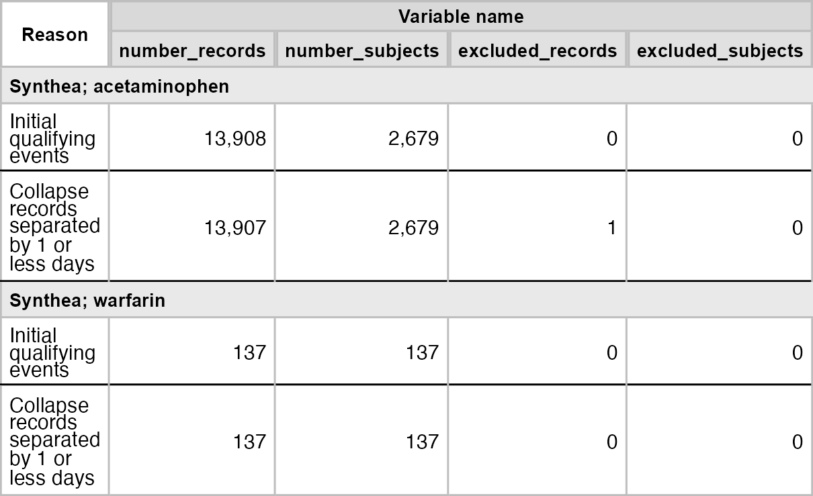

``` r
result |>
  filter(group_level == "161_acetaminophen") |>
  plotCohortAttrition()
```


### Characteristics

``` r
result <- summariseCharacteristics(cdm$my_cohort)
```

``` r
tableCharacteristics(result, type = "flextable")
```

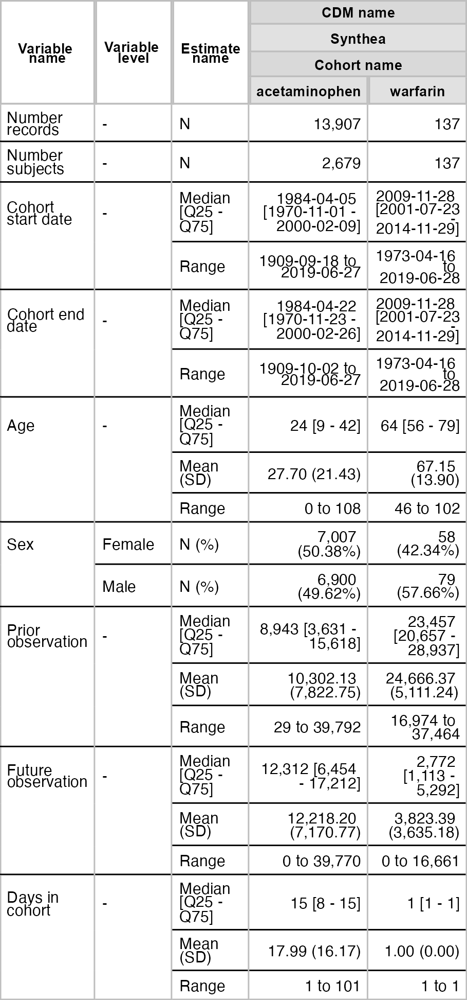

``` r
result |>
  filter(variable_name == "Age") |>
  plotCharacteristics(plotType = "boxplot", colour = "cohort_name")
```

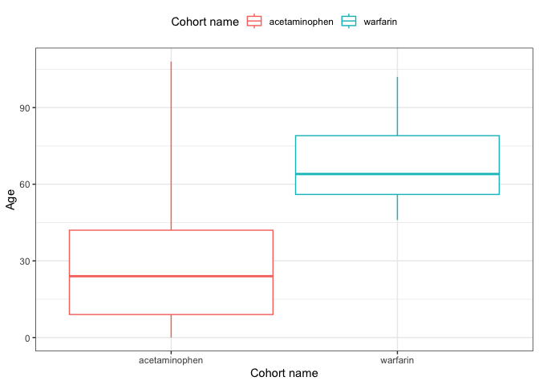

### Timing between cohorts

``` r
result <- summariseCohortTiming(cdm$my_cohort)
```

``` r
tableCohortTiming(result, type = "flextable")
```

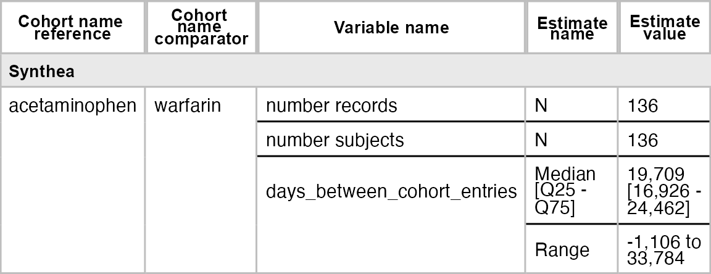

``` r
plotCohortTiming(
  result,
  uniqueCombinations = TRUE,
  facet = "cdm_name",
  colour = c("cohort_name_reference", "cohort_name_comparator"),
  timeScale = "years"
)
```

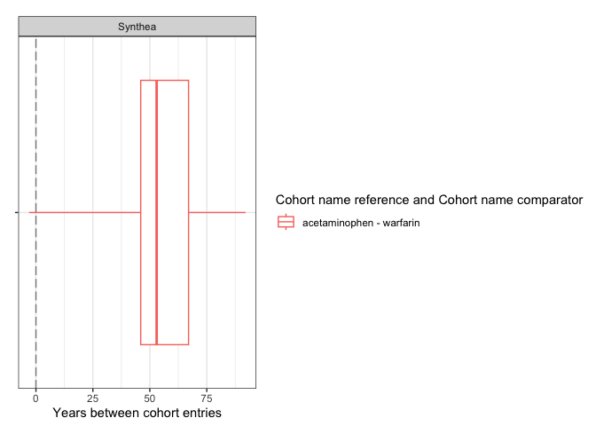

``` r
plotCohortTiming(
  result,
  plotType = "densityplot",
  uniqueCombinations = FALSE,
  facet = "cdm_name",
  colour = c("cohort_name_comparator"),
  timeScale = "years"
)
```

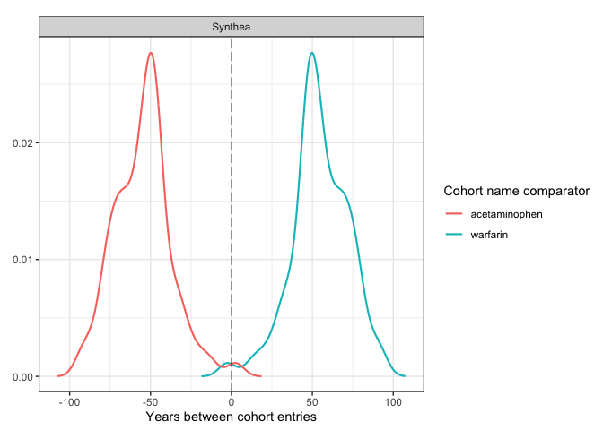

### Overlap between cohort

``` r
result <- summariseCohortOverlap(cdm$my_cohort)
```

``` r
tableCohortOverlap(result, type = "flextable")
```

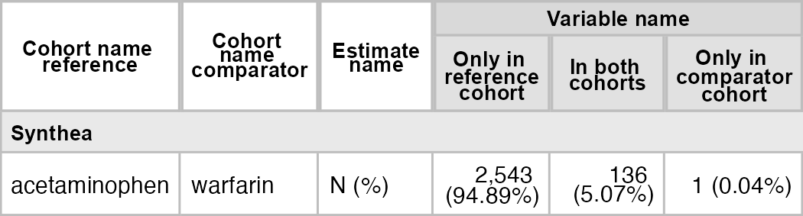

``` r
plotCohortOverlap(result, uniqueCombinations = TRUE)
```

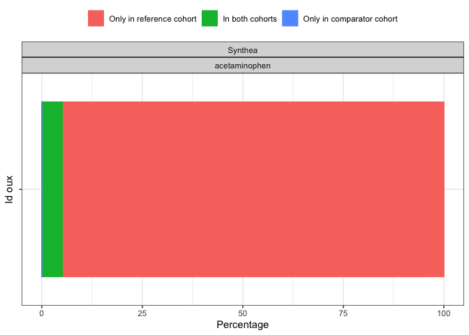

### Large scale characteristics

``` r
result <- cdm$my_cohort |>
  summariseLargeScaleCharacteristics(
    window = list(c(-90, -1), c(0, 0), c(1, 90)),
    eventInWindow = "condition_occurrence"
  )
```

``` r
tableLargeScaleCharacteristics(result, type = "flextable")
```

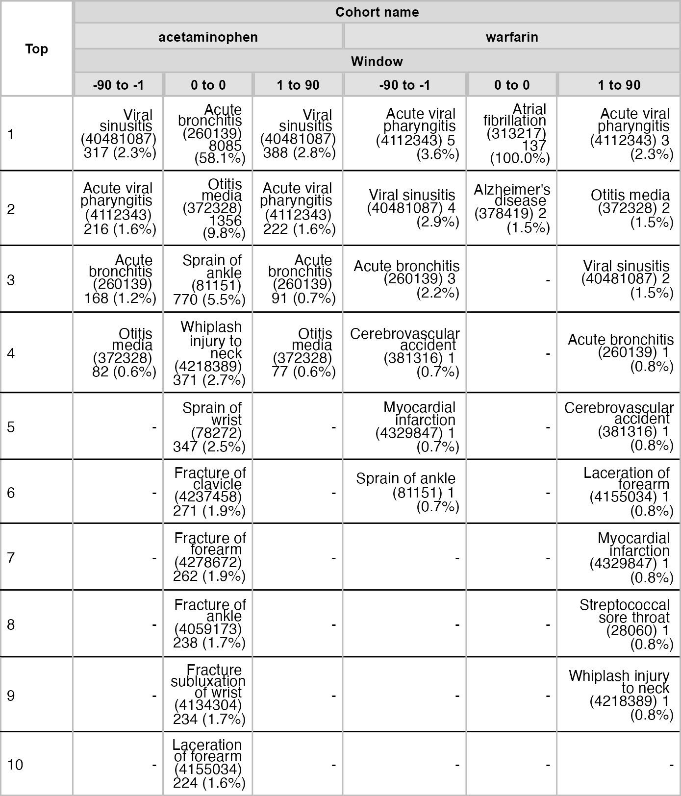

``` r
result |>
  filter(group_level == "161_acetaminophen") |>
  plotLargeScaleCharacteristics()
```

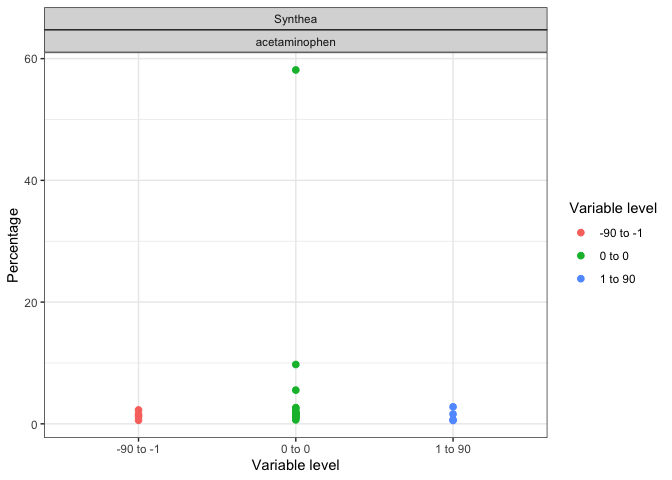

``` r
result |>
  filter(group_level == "161_acetaminophen", variable_level != "0 to 0") |>
  plotComparedLargeScaleCharacteristics(
    reference = c(variable_level = "-90 to -1"), colour = "variable_name"
  )
```

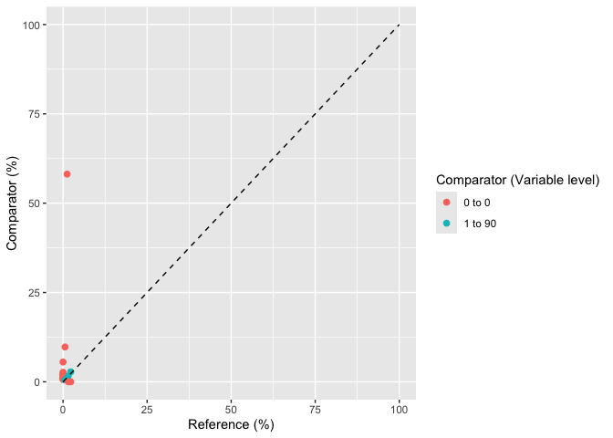

### Disconnect

Disconnect from your database using `CDMConnector::cdmDisconnect()` to
close the connection or with `mockDisconnect()` to close connection and
delete the created mock data:

``` r
mockDisconnect(cdm)
```

### Recommendations

Although it is technically possible, we do not recommend to pipe table
or plot functions with the summarise ones. The main reason is that
summarise functions take some time to run, a large scale
characterisation in a big cdm object can take a few hours. If we pipe
the output to a table/plot function we loose the summarise result
object. In fact, some times we would send code around to be ran in
others database and what we want to export is the summarised_result
objects and not the table or plot which we would like to build after
compiling results from different cdm objects.

**Not recommended**:

``` r
cdm$my_cohort |>
  summariseCharacteristics() |>
  tableCharacteristics()
```

**Recommended**:

``` r
x <- summariseCharacteristics(cdm$my_cohort)

tableCharacteristics(x)
```
