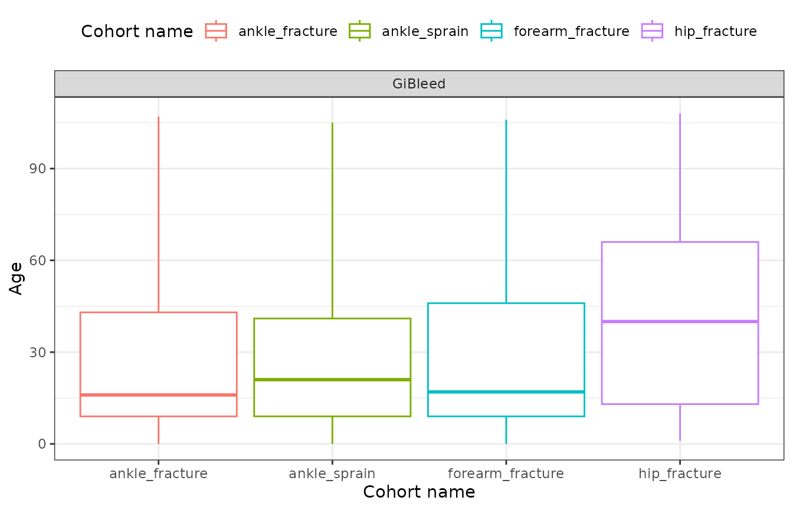
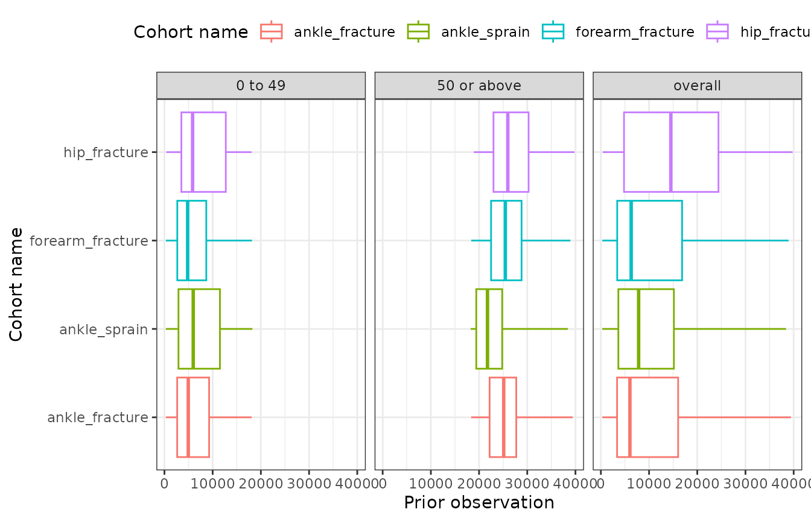
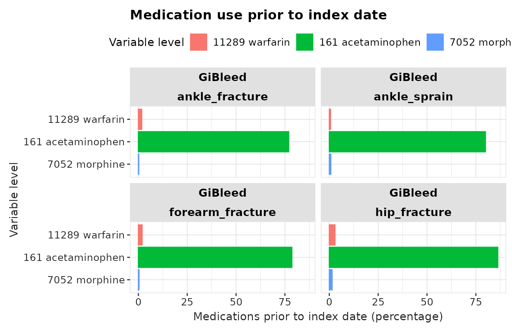

# Summarise patient characteristics

## Introduction

In this example we’re going to summarise the characteristics of
individuals with an ankle sprain, ankle fracture, forearm fracture, or a
hip fracture using the Eunomia synthetic database.

We’ll begin by creating our condition study cohorts with the
`generateConceptCohortSet` function from `CDMConnector`.

``` r
library(omock)
library(CDMConnector)
library(dplyr, warn.conflicts = FALSE)
library(ggplot2)
library(CodelistGenerator)
library(PatientProfiles)
library(CohortCharacteristics)

cdm <- mockCdmFromDataset(datasetName = "GiBleed", source = "duckdb")

cdm <- generateConceptCohortSet(
  cdm = cdm,
  name = "injuries",
  conceptSet = list(
    "ankle_sprain" = 81151,
    "ankle_fracture" = 4059173,
    "forearm_fracture" = 4278672,
    "hip_fracture" = 4230399
  ),
  end = "event_end_date",
  limit = "all"
)
settings(cdm$injuries)
#> # A tibble: 4 × 6
#>   cohort_definition_id cohort_name    limit prior_observation future_observation
#>                  <int> <chr>          <chr>             <dbl>              <dbl>
#> 1                    1 ankle_sprain   all                   0                  0
#> 2                    2 ankle_fracture all                   0                  0
#> 3                    3 forearm_fract… all                   0                  0
#> 4                    4 hip_fracture   all                   0                  0
#> # ℹ 1 more variable: end <chr>
cohortCount(cdm$injuries)
#> # A tibble: 4 × 3
#>   cohort_definition_id number_records number_subjects
#>                  <int>          <int>           <int>
#> 1                    1           1915            1357
#> 2                    2            464             427
#> 3                    3            569             510
#> 4                    4            138             132
```

## Summarising study cohorts

Now we’ve created our cohorts, we can obtain a summary of the
characteristics in the patients included in these cohorts. We’ll create
two different age group in below example: under 50 and 50+.

``` r
chars <- cdm$injuries |>
  summariseCharacteristics(ageGroup = list(c(0, 49), c(50, Inf)))
chars |>
  glimpse()
#> Rows: 220
#> Columns: 13
#> $ result_id        <int> 1, 1, 1, 1, 1, 1, 1, 1, 1, 1, 1, 1, 1, 1, 1, 1, 1, 1,…
#> $ cdm_name         <chr> "GiBleed", "GiBleed", "GiBleed", "GiBleed", "GiBleed"…
#> $ group_name       <chr> "cohort_name", "cohort_name", "cohort_name", "cohort_…
#> $ group_level      <chr> "ankle_sprain", "ankle_sprain", "ankle_sprain", "ankl…
#> $ strata_name      <chr> "overall", "overall", "overall", "overall", "overall"…
#> $ strata_level     <chr> "overall", "overall", "overall", "overall", "overall"…
#> $ variable_name    <chr> "Number records", "Number subjects", "Cohort start da…
#> $ variable_level   <chr> NA, NA, NA, NA, NA, NA, NA, NA, NA, NA, NA, NA, NA, N…
#> $ estimate_name    <chr> "count", "count", "min", "q25", "median", "q75", "max…
#> $ estimate_type    <chr> "integer", "integer", "date", "date", "date", "date",…
#> $ estimate_value   <chr> "1915", "1357", "1912-02-25", "1968-06-15", "1982-11-…
#> $ additional_name  <chr> "overall", "overall", "overall", "overall", "overall"…
#> $ additional_level <chr> "overall", "overall", "overall", "overall", "overall"…
```

Now we have generated the results, we can create a nice table in gt
format to display the results using `tableCharacteristics` function. By
default it returns summary statistics for, number records, number
subjects, age, cohort_start_date, cohort_end_date, prior_observations,
future_observations and days in cohort. Days in cohort is defined as the
number of days between the cohort start and end dates, inclusive of both
boundaries (i.e., cohort_end_date – cohort_start_date + 1). This
represents the total duration an individual in the cohort. In contrast,
future observation time is defined as the time from the cohort start
date to the end of the individual’s observation period
(observation_period_end_date – cohort_start_date). Prior observation
works similar to future observation but look at observations before
cohort_start_date, hence defined as (cohort_start_date -
observation_period_start_date). The difference in definitions arises
because days in cohort captures a duration within the cohort, while
future observation time measures a remaining time window for potential
follow-up beyond cohort entry.

``` r
tableCharacteristics(chars)
```

[TABLE]

We can also use the `plotCharacteristics` function to display the
results in a plot. The `plotCharacteristics` function can only take in
one variable. So you will need to filter the results to the variable you
want to create a plot for beforehand.

``` r
chars |>
  filter(variable_name == "Age") |>
  plotCharacteristics(
    plotType = "boxplot",
    colour = "cohort_name",
    facet = c("cdm_name")
  )
```



## Stratified summaries

We can also generate summaries that are stratified by some variable of
interest. In this example we added an age group variable to our cohort
table and then created the stratification for age group in our results.

``` r
chars <- cdm$injuries |>
  addAge(ageGroup = list(
    c(0, 49),
    c(50, Inf)
  )) |>
  summariseCharacteristics(strata = list("age_group"))
```

Again we used the `tableCharacteristics` function to display the results
in gt table format.

``` r
tableCharacteristics(chars,
  groupColumn = "age_group"
)
```

[TABLE]

Then plotted age stratified prior observation time.

``` r
chars |>
  filter(variable_name == "Prior observation") |>
  plotCharacteristics(
    plotType = "boxplot",
    colour = "cohort_name",
    facet = c("age_group")
  ) +
  coord_flip()
```



## Summaries including presence in other cohorts

We explored whether patients had any exposure to a list of selected
medications (acetaminophen, morphine, warfarin)

``` r
medsCs <- getDrugIngredientCodes(
  cdm = cdm,
  name = c("acetaminophen", "morphine", "warfarin")
)
cdm <- generateConceptCohortSet(
  cdm = cdm,
  name = "meds",
  conceptSet = medsCs,
  end = "event_end_date",
  limit = "all",
  overwrite = TRUE
)
```

We can use the `intersects` arguement inside the function to get this
information.

``` r
chars <- cdm$injuries |>
  summariseCharacteristics(cohortIntersectFlag = list(
    "Medications prior to index date" = list(
      targetCohortTable = "meds",
      window = c(-Inf, -1)
    ),
    "Medications on index date" = list(
      targetCohortTable = "meds",
      window = c(0, 0)
    )
  ))
```

To view the summary table

``` r
tableCharacteristics(chars)
```

[TABLE]

To visualise the exposure of these drugs in a bar plot.

``` r
plot_data <- chars |>
  filter(
    variable_name == "Medications prior to index date",
    estimate_name == "percentage"
  )

plot_data |>
  plotCharacteristics(
    plotType = "barplot",
    colour = "variable_level",
    facet = c("cdm_name", "cohort_name")
  ) +
  scale_x_discrete(limits = rev(sort(unique(plot_data$variable_level)))) +
  coord_flip() +
  ggtitle("Medication use prior to index date")
```



## Summaries Using Concept Sets Directly

Instead of creating cohorts, we could have directly used our concept
sets for medications when characterising our study cohorts.

``` r
chars <- cdm$injuries |>
  summariseCharacteristics(conceptIntersectFlag = list(
    "Medications prior to index date" = list(
      conceptSet = medsCs,
      window = c(-Inf, -1)
    ),
    "Medications on index date" = list(
      conceptSet = medsCs,
      window = c(0, 0)
    )
  ))
```

Although, like here, concept sets can lead to the same result as using
cohorts it is important to note this will not always be the case. This
is because the creation of cohorts will have involved the collapsing of
overlapping records as well as imposing certain requirements, such as
only including records that were observed during an an ongoing
observation period. Meanwhile, when working with concept sets we will
instead be working directly with record-level data.

``` r
tableCharacteristics(chars)
```

[TABLE]

## Summaries using clinical tables

More generally, we can also include summaries of the patients’ presence
in other clinical tables of the OMOP CDM. For example, here we add a
count of visit occurrences

``` r
chars <- cdm$injuries |>
  summariseCharacteristics(
    tableIntersectCount = list(
      "Visits in the year prior" = list(
        tableName = "visit_occurrence",
        window = c(-365, -1)
      )
    ),
    tableIntersectFlag = list(
      "Any drug exposure in the year prior" = list(
        tableName = "drug_exposure",
        window = c(-365, -1)
      ),
      "Any procedure in the year prior" = list(
        tableName = "procedure_occurrence",
        window = c(-365, -1)
      )
    )
  )
```

``` r
tableCharacteristics(chars)
```

[TABLE]
