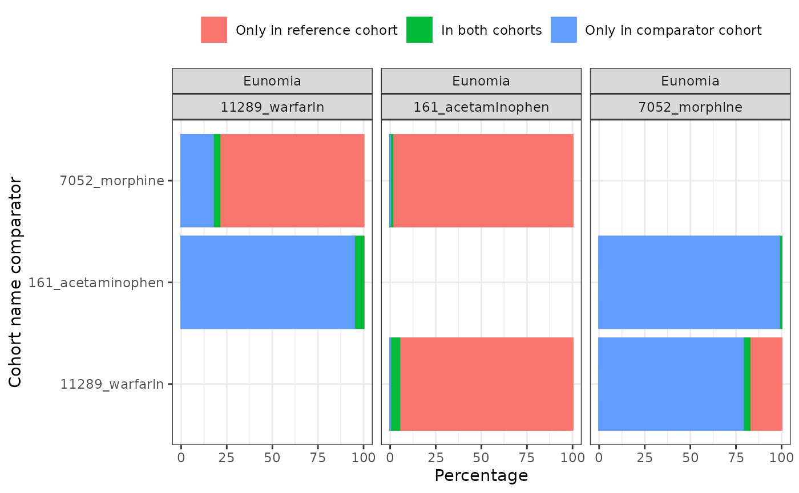
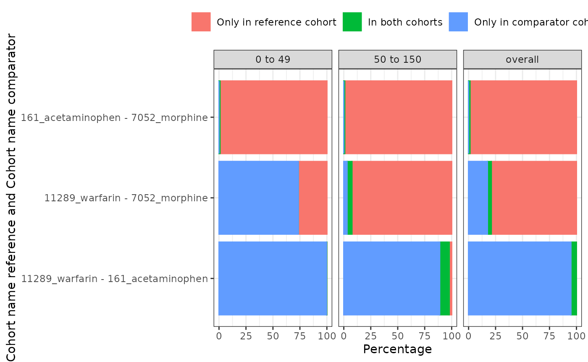

# Summarise cohort overlap

When creating multiple cohorts we might be interested in the overlap
between them. That is, how many individuals appear in multiple cohorts.
CohortCharacteristics provides functions to generate such estimates and
then summarise these estimates in tables and plots.

To see how this works let’s create a few medication cohorts with the
Eunomia synthetic dataset.

``` r
library(omock)
library(CDMConnector)
library(dplyr, warn.conflicts = FALSE)
library(CodelistGenerator)
library(PatientProfiles)
library(CohortCharacteristics)

cdm <- mockCdmFromDataset(datasetName = "GiBleed", source = "duckdb")

medsCs <- getDrugIngredientCodes(
  cdm = cdm,
  name = c(
    "acetaminophen",
    "morphine",
    "warfarin"
  )
)

cdm <- generateConceptCohortSet(
  cdm = cdm,
  name = "meds",
  conceptSet = medsCs,
  end = "event_end_date",
  limit = "all",
  overwrite = TRUE
)

settings(cdm$meds)
#> # A tibble: 3 × 6
#>   cohort_definition_id cohort_name    limit prior_observation future_observation
#>                  <int> <chr>          <chr>             <dbl>              <dbl>
#> 1                    1 11289_warfarin all                   0                  0
#> 2                    2 161_acetamino… all                   0                  0
#> 3                    3 7052_morphine  all                   0                  0
#> # ℹ 1 more variable: end <chr>
cohortCount(cdm$meds)
#> # A tibble: 3 × 3
#>   cohort_definition_id number_records number_subjects
#>                  <int>          <int>           <int>
#> 1                    1            137             137
#> 2                    2          13908            2679
#> 3                    3             35              35
```

Now we have our cohorts we can summarise the overlap between them.

``` r
medsOverlap <- cdm$meds |>
  summariseCohortOverlap()
medsOverlap |>
  glimpse()
#> Rows: 36
#> Columns: 13
#> $ result_id        <int> 1, 1, 1, 1, 1, 1, 1, 1, 1, 1, 1, 1, 1, 1, 1, 1, 1, 1,…
#> $ cdm_name         <chr> "GiBleed", "GiBleed", "GiBleed", "GiBleed", "GiBleed"…
#> $ group_name       <chr> "cohort_name_reference &&& cohort_name_comparator", "…
#> $ group_level      <chr> "11289_warfarin &&& 161_acetaminophen", "11289_warfar…
#> $ strata_name      <chr> "overall", "overall", "overall", "overall", "overall"…
#> $ strata_level     <chr> "overall", "overall", "overall", "overall", "overall"…
#> $ variable_name    <chr> "Only in reference cohort", "In both cohorts", "Only …
#> $ variable_level   <chr> "Subjects", "Subjects", "Subjects", "Subjects", "Subj…
#> $ estimate_name    <chr> "count", "count", "count", "count", "count", "count",…
#> $ estimate_type    <chr> "integer", "integer", "integer", "integer", "integer"…
#> $ estimate_value   <chr> "1", "136", "2543", "131", "6", "29", "2543", "136", …
#> $ additional_name  <chr> "overall", "overall", "overall", "overall", "overall"…
#> $ additional_level <chr> "overall", "overall", "overall", "overall", "overall"…
```

We have table and plotting functions to help view our results. The
`uniqueCombinations` can be use to include/exclude non unique
combinations between the comparator and reference cohorts for the
overlap.

``` r
tableCohortOverlap(medsOverlap, uniqueCombinations = FALSE)
```

[TABLE]

``` r
plotCohortOverlap(medsOverlap, uniqueCombinations = FALSE)
```



As well as generating these estimates for cohorts overall, we can also
obtain stratified estimates. In this example we’ll add age groups to our
cohort table, and then obtain estimates stratified by these groups.

``` r
cdm$meds <- cdm$meds |>
  addAge(ageGroup = list(c(0, 49), c(50, 150))) |>
  compute(temporary = FALSE, name = "meds") |>
  newCohortTable()
medsOverlap <- cdm$meds |>
  summariseCohortOverlap(strata = list("age_group"))
```

As with our overall results, we can quickly create tables and figures to
view our stratified results.

``` r
tableCohortOverlap(medsOverlap, uniqueCombinations = FALSE)
```

[TABLE]

``` r
plotCohortOverlap(
  medsOverlap,
  facet = c("age_group"),
  uniqueCombinations = TRUE
)
```


