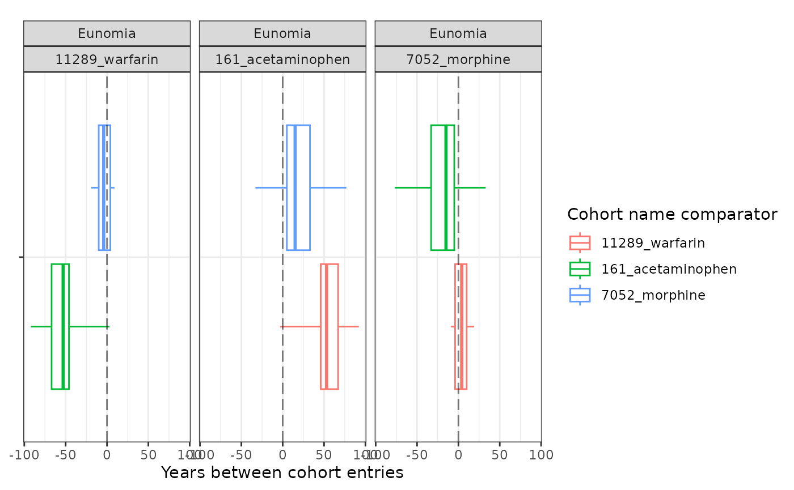
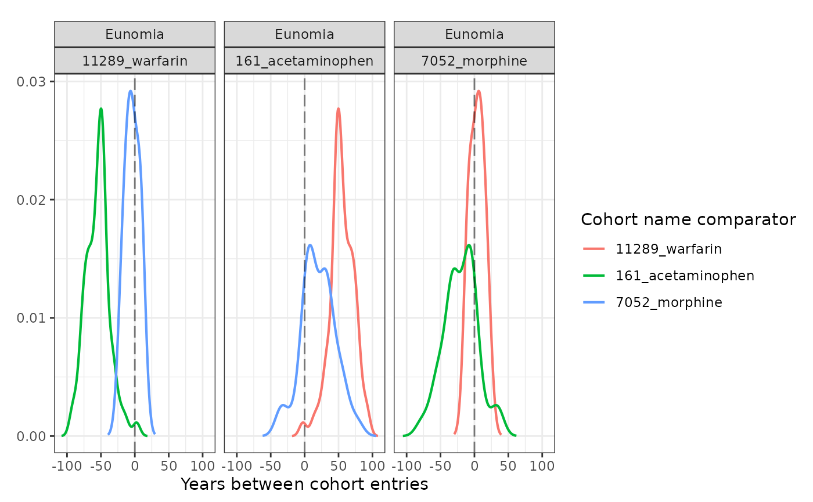

# Summarise cohort timing

We saw in the previous vignette how we can summarise the overlap between
cohorts. In addition to this, we might also be interested in timings
between cohorts. That is, the time between an individual entering one
cohort and another. For this we can use the
[`summariseCohortTiming()`](https://darwin-eu.github.io/CohortCharacteristics/reference/summariseCohortTiming.md).
In this example we’ll look at the time between entering cohorts for
acetaminophen, morphine, and oxycodone using the Eunomia data.

``` r
library(omock)
library(CDMConnector)
library(dplyr, warn.conflicts = FALSE)
library(CodelistGenerator)
library(PatientProfiles)
library(CohortCharacteristics)

cdm <- mockCdmFromDataset(datasetName = "GiBleed", source = "duckdb")

medsCs <- getDrugIngredientCodes(
  cdm = cdm,
  name = c(
    "acetaminophen",
    "morphine",
    "warfarin"
  )
)

cdm <- generateConceptCohortSet(
  cdm = cdm,
  name = "meds",
  conceptSet = medsCs,
  end = "event_end_date",
  limit = "all",
  overwrite = TRUE
)

settings(cdm$meds)
#> # A tibble: 3 × 6
#>   cohort_definition_id cohort_name    limit prior_observation future_observation
#>                  <int> <chr>          <chr>             <dbl>              <dbl>
#> 1                    1 11289_warfarin all                   0                  0
#> 2                    2 161_acetamino… all                   0                  0
#> 3                    3 7052_morphine  all                   0                  0
#> # ℹ 1 more variable: end <chr>
cohortCount(cdm$meds)
#> # A tibble: 3 × 3
#>   cohort_definition_id number_records number_subjects
#>                  <int>          <int>           <int>
#> 1                    1            137             137
#> 2                    2          13908            2679
#> 3                    3             35              35
```

Now we have our cohorts we can summarise the timing between cohort
entry. Note setting restrictToFirstEntry to TRUE will mean that we only
consider timing between an individual’s first record in each cohort
(i.e. their first exposure to each of the medications).

``` r
medsTiming <- cdm$meds |>
  summariseCohortTiming(restrictToFirstEntry = TRUE)
medsTiming |>
  glimpse()
#> Rows: 6,186
#> Columns: 13
#> $ result_id        <int> 1, 1, 1, 1, 1, 1, 1, 1, 1, 1, 1, 1, 1, 1, 1, 1, 1, 1,…
#> $ cdm_name         <chr> "GiBleed", "GiBleed", "GiBleed", "GiBleed", "GiBleed"…
#> $ group_name       <chr> "cohort_name_reference &&& cohort_name_comparator", "…
#> $ group_level      <chr> "11289_warfarin &&& 161_acetaminophen", "11289_warfar…
#> $ strata_name      <chr> "overall", "overall", "overall", "overall", "overall"…
#> $ strata_level     <chr> "overall", "overall", "overall", "overall", "overall"…
#> $ variable_name    <chr> "number records", "number subjects", "days_between_co…
#> $ variable_level   <chr> NA, NA, NA, NA, NA, NA, NA, "density_001", "density_0…
#> $ estimate_name    <chr> "count", "count", "min", "q25", "median", "q75", "max…
#> $ estimate_type    <chr> "integer", "integer", "integer", "integer", "integer"…
#> $ estimate_value   <chr> "136", "136", "-33784", "-24462", "-19709", "-16926",…
#> $ additional_name  <chr> "overall", "overall", "overall", "overall", "overall"…
#> $ additional_level <chr> "overall", "overall", "overall", "overall", "overall"…
```

As with cohort overlap, we have table and plotting functions to help
view our results.

``` r
tableCohortTiming(medsTiming, timeScale = "years", uniqueCombinations = FALSE)
```

| Cohort name reference | Cohort name comparator | Variable name                | Estimate name        | Estimate value             |
|-----------------------|------------------------|------------------------------|----------------------|----------------------------|
| GiBleed               |                        |                              |                      |                            |
| 11289_warfarin        | 161_acetaminophen      | number records               | N                    | 136                        |
|                       |                        | number subjects              | N                    | 136                        |
|                       |                        | years_between_cohort_entries | Median \[Q25 - Q75\] | -53.96 \[-66.97 - -46.34\] |
|                       |                        |                              | Range                | -92.50 to 3.03             |
|                       | 7052_morphine          | number records               | N                    | 6                          |
|                       |                        | number subjects              | N                    | 6                          |
|                       |                        | years_between_cohort_entries | Median \[Q25 - Q75\] | -4.54 \[-10.36 - 4.76\]    |
|                       |                        |                              | Range                | -18.99 to 9.24             |
| 161_acetaminophen     | 11289_warfarin         | number records               | N                    | 136                        |
|                       |                        | number subjects              | N                    | 136                        |
|                       |                        | years_between_cohort_entries | Median \[Q25 - Q75\] | 53.96 \[46.34 - 66.97\]    |
|                       |                        |                              | Range                | -3.03 to 92.50             |
|                       | 7052_morphine          | number records               | N                    | 35                         |
|                       |                        | number subjects              | N                    | 35                         |
|                       |                        | years_between_cohort_entries | Median \[Q25 - Q75\] | 15.79 \[5.02 - 33.51\]     |
|                       |                        |                              | Range                | -33.72 to 77.29            |
| 7052_morphine         | 11289_warfarin         | number records               | N                    | 6                          |
|                       |                        | number subjects              | N                    | 6                          |
|                       |                        | years_between_cohort_entries | Median \[Q25 - Q75\] | 4.54 \[-4.76 - 10.36\]     |
|                       |                        |                              | Range                | -9.24 to 18.99             |
|                       | 161_acetaminophen      | number records               | N                    | 35                         |
|                       |                        | number subjects              | N                    | 35                         |
|                       |                        | years_between_cohort_entries | Median \[Q25 - Q75\] | -15.79 \[-33.51 - -5.02\]  |
|                       |                        |                              | Range                | -77.29 to 33.72            |

``` r
plotCohortTiming(
  medsTiming,
  plotType = "boxplot",
  timeScale = "years",
  uniqueCombinations = FALSE
)
```



If we want to see an even more granular summary of cohort timings we can
make a density plot instead of a box plot. Note, for this we’ll need to
set density to include ‘density’ as one of the estimates.

``` r
plotCohortTiming(
  medsTiming,
  plotType = "densityplot",
  timeScale = "years",
  uniqueCombinations = FALSE
)
```



As well as generating these estimates for cohorts overall, we can also
obtain stratified estimates.

``` r
cdm$meds <- cdm$meds |>
  addAge(ageGroup = list(c(0, 49), c(50, 150))) |>
  compute(temporary = FALSE, name = "meds") |>
  newCohortTable()
medsTiming <- cdm$meds |>
  summariseCohortTiming(
    restrictToFirstEntry = TRUE,
    strata = list("age_group"),
    density = TRUE
  )
tableCohortTiming(medsTiming, timeScale = "years")
```

[TABLE]

``` r
plotCohortTiming(medsTiming,
  plotType = "boxplot",
  timeScale = "years",
  facet = "age_group",
  colour = "age_group",
  uniqueCombinations = TRUE
)
```


